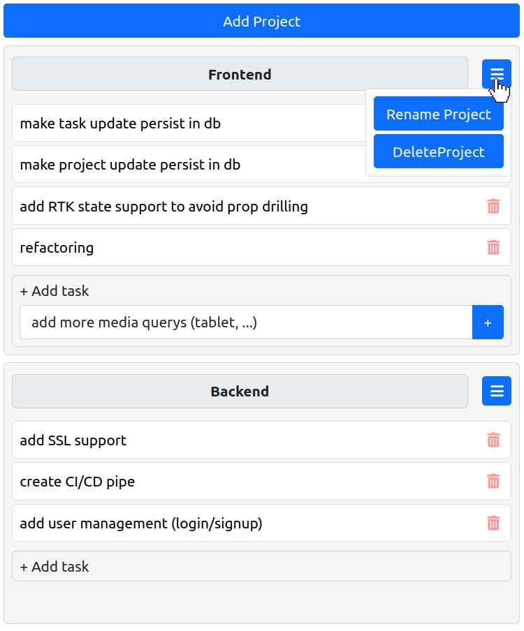
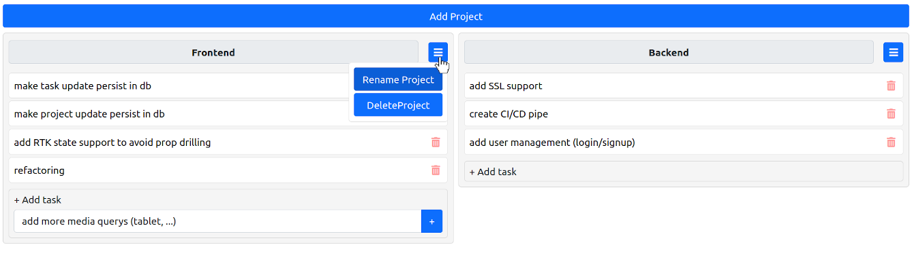

# Project: trello-clone

### 1. Description
The trello clone enables the user to add, to edit and to remove projects and tasks. Data is persisted in a database.

### 2. Tech Stack
#### 2.1 Frontend
+ React (class based components)
+ Bootstrap / SASS
+ Axios

#### 2.2 Backend
+ Express
+ PostgreSQL

### 3. Screenshots
+ Screenshot 1:

+Screenshot 2:

### 4. Notes
+ Frontend built with Node 14

